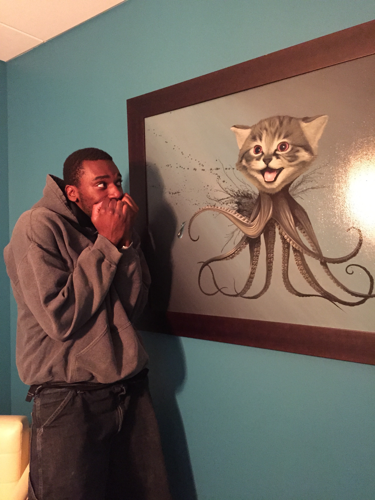

#git-kitty
Github Patchwork

##Story
Once upon a time... there was a kitty... but it wasn't an ordinary kitty. It was an Octokitty.
Octokitty was afraid of Johnoy and Johnoy was afraid of Octokitty what a conundrum! oh no !
Johnoy had every reason to fear the kitty, as it clear she had malice in her heart. And what is the deal
with whatever is hanging out of the back side of the kitty. I mean the cat octopus combo makes
no sense as it is, but that fungus or whatever really sets the whole thing off.

I mean, what are we really talking about here. A cat. An octopus. A freakish, slighty too realistic rendition of the Octocat. There's too many legs! In the spirit of GitHub's Patchwork Boulder, we salute you Octocat picture in the back corner of the office. You have inspired this story, a series of commits, pull-requests, and plain 'ole fun.
