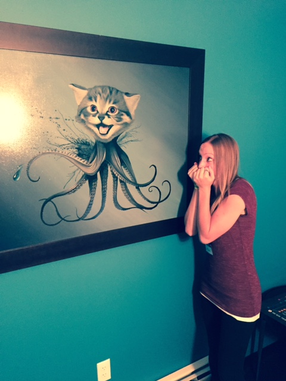

#git-kitty
Github Patchwork

##Story
Once upon a time... there was a kitty... but it wasn't an ordinary kitty. It was an Octokitty.
Octokitty was afraid of Johnoy, and Johnoy was afraid of Octokitty. What a conundrum!
Johnoy had every reason to fear the kitty, as it was clear she had malice in her heart.

What are we really talking about here? A cat. An octopus. A freakish, slighty too realistic rendition of the Octocat. There's too many legs! In the spirit of GitHub's Patchwork Boulder, we salute you Octocat picture in the back corner of the office. You have inspired this story, a series of commits, pull-requests, and plain 'ole fun.
